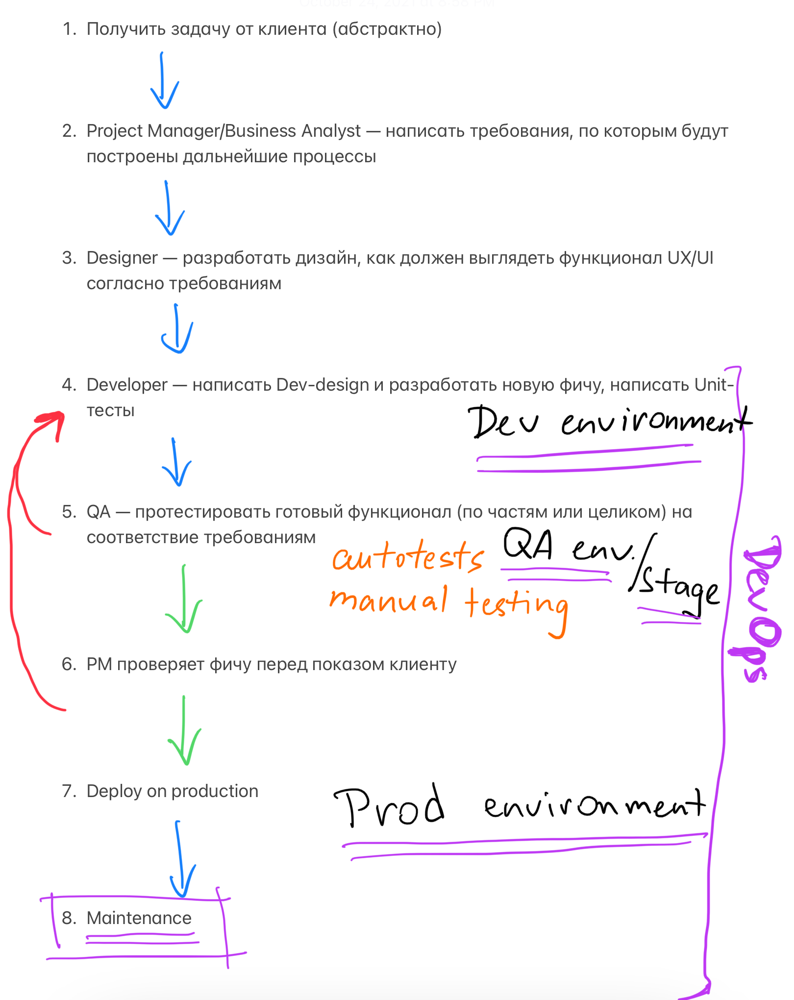

## Задание №2 - Описание жизненного цикла задачи (разработки нового функционала)

Чтобы лучше понимать предназначение дальнейших инструментов, с которыми нам предстоит работать, давайте 
составим схему жизненного цикла задачи в идеальном для вас случае.

### Описание истории

Представьте, что вы работаете в стартапе, который запустил интернет-магазин. Ваш интернет-магазин достаточно успешно развивался, и вот пришло время налаживать процессы: у вас стало больше конечных клиентов, менеджеров и разработчиков. Сейчас от клиентов вам приходят задачи, связанные с разработкой нового функционала. Задач много, и все они требуют выкладки на тестовые среды, одобрения тестировщика, проверки менеджером перед показом клиенту. В случае необходимости, вам будет необходим откат изменений. 

### Решение задачи
Процесс решения задачи в соответствии с жизненным циклом разработки программного обеспечения будет выглядеть следующим образом:

Как видно на схеме, DevOps как участник процесса появляется перед этапом разработки. 
DevOps инженеру нужно развернуть минимум 3 одинаковых окружения: 
1. Dev для разработки, 
2. QA (a.k.a. Stage) для тестирования,
3. Production (подразумевается, что эта среда уже имеется, если мы находимся в процессе налаживания процессов).

Кроме того, нужно обеспечить:
 - независимость окружений, но при этом важно, чтобы они были одинаковы (независимость необходима для того, чтобы если вдруг что-то пойдёт не так на одном окружении, оно не повлияло на "живых" клиентов, т.е. на другие окружения);
 - автоматизацию процессов деплоя на каждое окружение (в идеале);
 - мониторинг и логирование всех окружений и взаимодействия систем;
 - прохождение тестов в автоматическом режиме и приостановление дальнейшего процесса продвижения фичи (в идеале: если тесты не прошли, автоматически остановить процесс и вернуть фичу на доработку с информацией о том, что именно пошло не так)

Можно сказать, что наличие DevOps в команде позволяет сделать релизный процесс более гладким и продуктивным.
